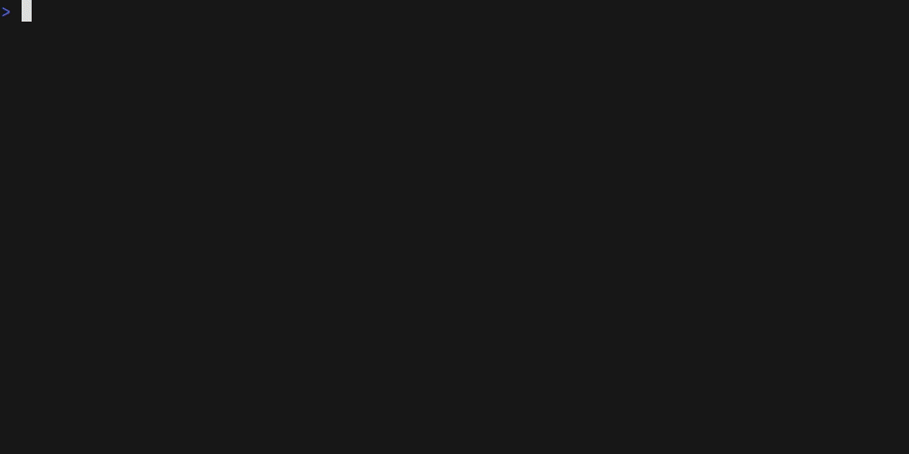
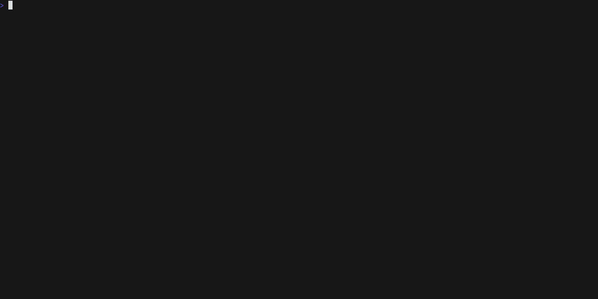

# whyis.nvim

A Neovim plugin that explains LSP diagnostics from linters — *Why is bad?*

Supports displaying explanations in a floating window or scratch buffer, via [hover.nvim](https://github.com/lewis6991/hover.nvim).

- Example `clippy`



- Example `ruff`


# Requirements

- Neovim 0.10+
- Your linter(s) of choice (clippy, ruff, ...)
- [hover.nvim](https://github.com/lewis6991/hover.nvim) *(optional — required only for hover integration)*
- [render-markdown.nvim](https://github.com/MeanderingProgrammer/render-markdown.nvim) *(optional)*

# Supported Linters

| Linter                                             | Language   |
| --------                                           | ---------- |
| [clippy](https://github.com/rust-lang/rust-clippy) | Rust       |
| [bacon-ls](https://github.com/crisidev/bacon-ls)   | Rust       |
| [ruff](https://github.com/astral-sh/ruff)          | Python     |
| [biome](https://github.com/biomejs/biome)          | Typescript |


# Installation

## lazy.nvim

### Scratch buffer / Floating window (without hover.nvim)

You can use `Whyis <win_opt>` command like following.

```lua
{
  "takeshid/whyis.nvim",
  event = "VeryLazy",
  keys = {
    {"<leader>wf", "<cmd>Whyis float<cr>", desc = "Whyis floating window"},
    {"<leader>wl", "<cmd>Whyis right<cr>", desc = "Whyis right side"},
  }
}
```

Inside the floating window press `q` or `<Esc>` to close it.

> [!WARNING]
> This plugin has no config yet.

### With hover.nvim


```lua
{
  "lewis6991/hover.nvim",
  dependencies = {
    "takeshid/whyis.nvim",
  },
  config = function()
    vim.keymap.set("n", "K", require("hover").hover, { desc = "hover.nvim" })
    require("hover").config({
      providers = {
        "hover.providers.diagnostic",
        "hover.providers.lsp",
        "whyis.hover",  -- add your configration
      },
      preview_opts = { border = "single" },
      preview_window = true,
      title = true,
    })
  end,
}
```


# License

MIT
